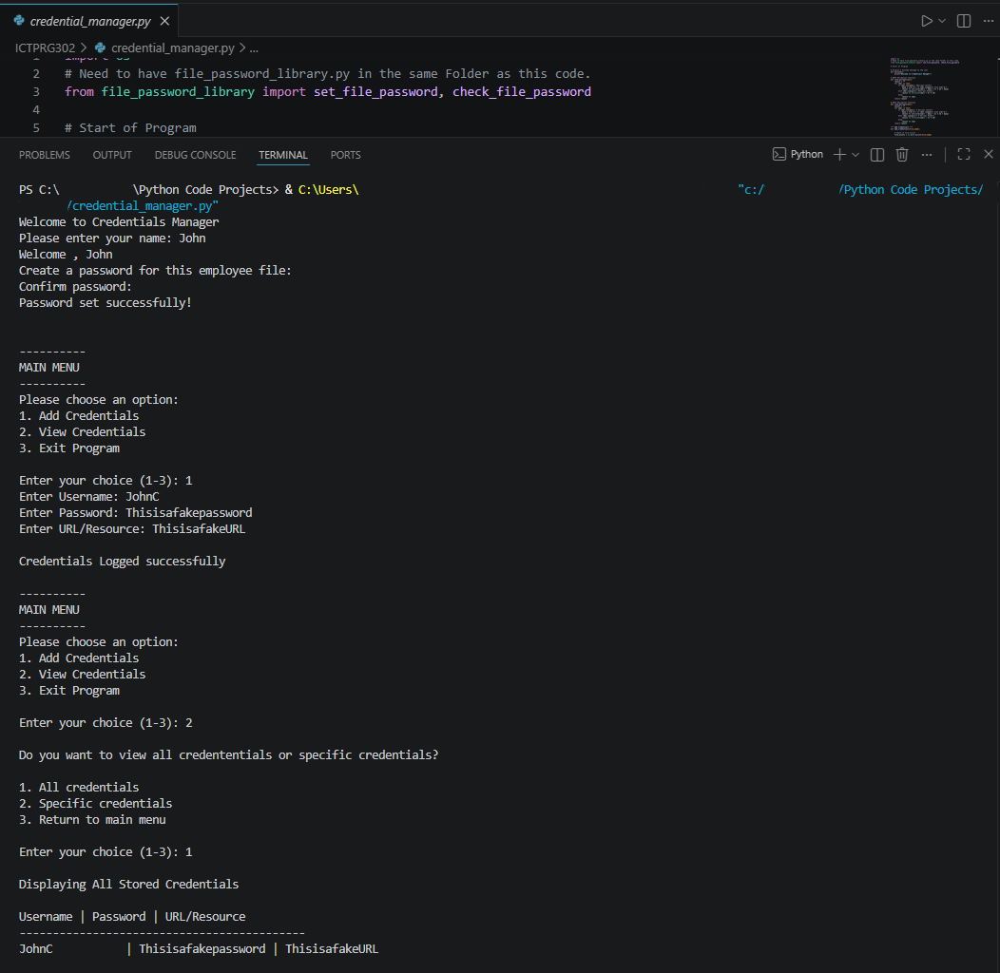

# Credential Manager

Python-based credential management application developed to practise file handling, password hashing, authentication workflows, and basic encryption concepts within a cybersecurity-focused CLI environment.

> ⚠️ Educational Notice
> This project uses ROT3-style credential obfuscation for educational purposes only and is **not** suitable for real-world credential security.

---

## Overview

This project allows users to create password-protected credential files for storing and retrieving usernames and passwords through a command-line interface.

The application uses SHA256 password hashing for file authentication and session-based access tracking to manage access to stored credentials.

The project was developed to better understand:

* Authentication workflows
* Password hashing
* File handling
* Basic encryption/decryption logic
* CLI application development
* Security-focused programming concepts

---

## Features

* Password-protected credential files
* SHA256 password hashing
* Session-based access management
* Credential storage and retrieval
* ROT3-based credential obfuscation
* File-based credential management
* CLI menu-driven interface
* Input validation and authentication checks

---

## Technologies Used

* Python 3
* hashlib (SHA256)
* File handling
* CLI interaction

---

## Skills Practised

* Python scripting
* File handling
* Password hashing
* Authentication workflows
* Basic encryption and decryption concepts
* CLI application development
* Security-focused programming
* Input validation

---

## Example Usage

```bash id="jlwm109"
python credential_manager.py
```

Example workflow:

```text id="jlwm110"
Create a password for this employee file:
Confirm password:
Password set successfully!

Enter your password to access this file:
Access granted.

Username: admin
Password: ********
```

---

## Screenshot



---

## Security Notes

This project was developed for educational purposes to practise cybersecurity and programming concepts.

Security limitations include:

* ROT3 is not secure encryption
* Credentials are stored locally
* No secure key management
* No database-backed storage

---

## Future Improvements

* Replace ROT3 with AES encryption
* Add credential editing and deletion
* Implement secure password policies
* Store credentials using SQLite
* Add GUI interface
* Improve session handling
* Add encrypted export functionality

---

## Disclaimer

This project was created for educational and authorised use only.
