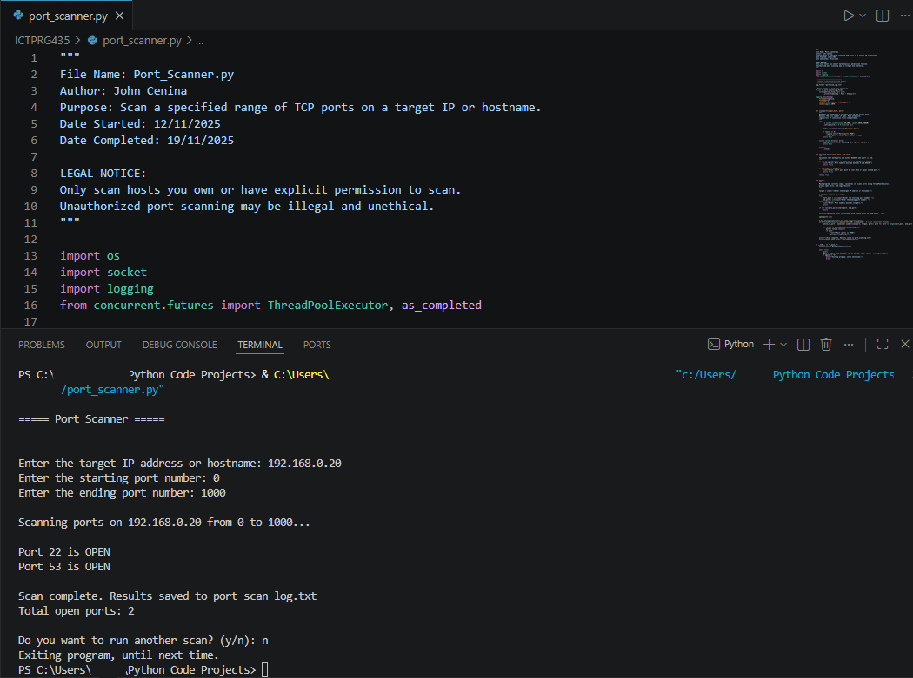

# TCP Port Scanner

Python-based multithreaded TCP port scanner developed to practise networking, reconnaissance, socket programming, logging, and security-focused automation concepts.

> ⚠️ Legal Notice
> Only scan hosts you own or have explicit permission to scan.
> Unauthorised port scanning may be illegal or unethical.

---

## Overview

This project uses Python sockets and multithreading to scan a specified range of TCP ports on a target IP address or hostname. Open ports are displayed in the terminal and logged to a local log file for review.

The scanner was developed as part of hands-on cybersecurity and networking practice to better understand:

* TCP communication
* Service exposure
* Network reconnaissance
* Basic attack surface analysis
* Python-based security tooling

---

## Features

* TCP port scanning
* Multithreaded scanning using `ThreadPoolExecutor`
* Open port detection
* Port range validation
* Logging to file
* Error handling and exception management
* CLI-based workflow

---

## Technologies Used

* Python 3
* Python sockets
* ThreadPoolExecutor
* Logging module

---

## Skills Practised

* Python scripting
* Socket programming
* Network reconnaissance
* Multithreading
* Input validation
* Logging and monitoring
* CLI application development
* Security-focused automation

---

## Example Usage

```bash
python port_scanner.py
```

Example:

```text
===== Welcome to the Digicore port scanner =====

Enter the target IP address or hostname: 192.168.0.20
Enter the starting port number: 1
Enter the ending port number: 1000

Scanning ports on 192.168.0.20 from 1 to 1000...

Port 22 is OPEN
Port 80 is OPEN
Port 443 is OPEN

Scan complete. Results saved to port_scan_log.txt
Total open ports: 3
```

---

## Screenshot



---

## Logging

Scan results are automatically written to:

```text
port_scan_log.txt
```

The log file records:

* Timestamp
* Port number
* Open port status
* Scan errors (if encountered)

---

## Future Improvements

* UDP scanning support
* Banner grabbing
* Service/version detection
* Export scan results to CSV
* IPv6 support
* GUI interface
* Scan timing metrics

---

## Disclaimer

This project was created for educational and authorised testing purposes only.
